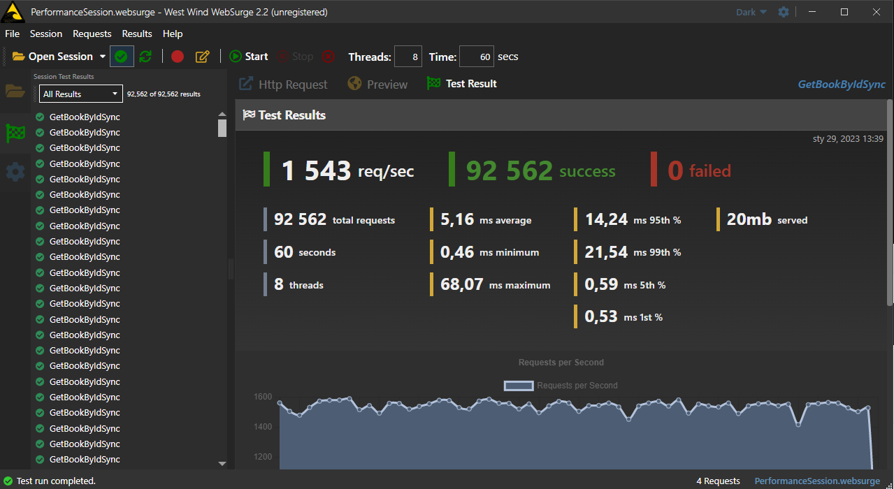
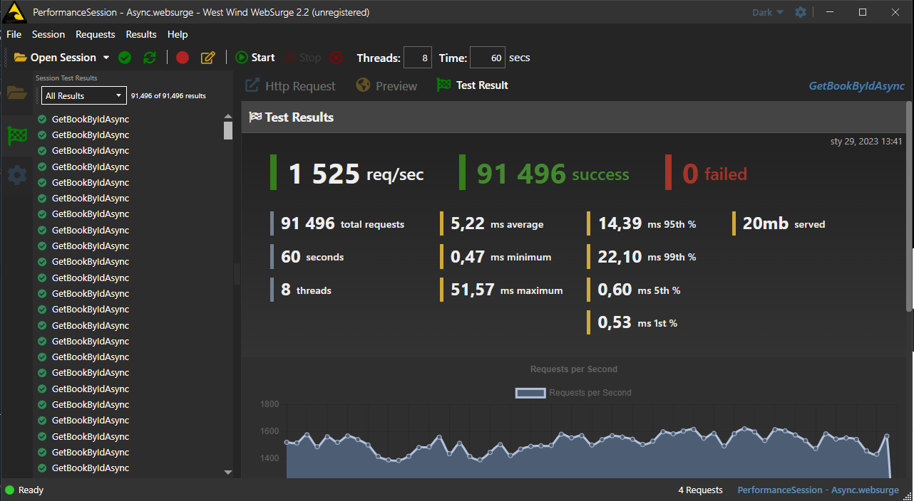
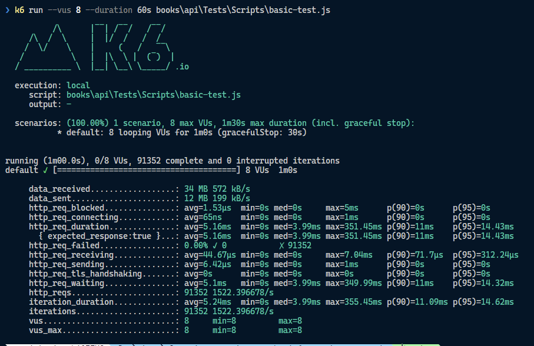
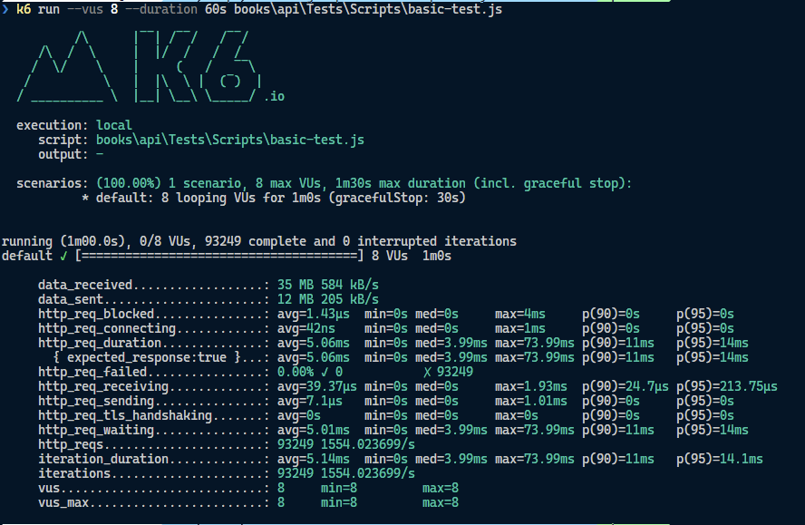

# Learning ASP.NET Core - WebAPI (.NET 7) Asynchronous Code

This repository contains resources helping with understanding how to use asynchronous programming while creating WebAPI applications.

Based on this course [Developing an Asynchronous ASP.NET Core 6 Web API](https://app.pluralsight.com/library/courses/asp-dot-net-core-6-web-api-developing-asynchronous/table-of-contents) :+1:.

Original course materials can be found [here](https://app.pluralsight.com/library/courses/asp-dot-net-core-6-web-api-developing-asynchronous/exercise-files) and [here](https://github.com/KevinDockx/DevelopingAsyncWebAPIAspNetCore6).

This project was upgraded from .NET 6 to .NET 7.

## Setup

First run "external" covers API:

```cmd
cd .\books\external_api
dotnet run
cd ..
```

Then run books API:

```cmd
cd .\books\api
dotnet watch run
cd ..
```

Of course, you can use your favorite IDE to run projects :-).

## Benefits of Asynchronous Programming

- **scalability** (scaling up) - asynchronous programming allows you to perform multiple operations at the same time. This can improve the scalability of your application,
- asynchronous code might or might not be **faster** than synchronous code. It depends on the operation and the context.

We must understand our workload and the context in which we are executing our code. We must also understand the performance characteristics of the operations we are performing.

Our code can be I/O-bound or CPU-bound. I/O-bound code is code that is waiting for an I/O operation to complete. CPU-bound code is code that is performing a CPU-intensive operation. In case of I/O-bound code, asynchronous code might be faster than synchronous code. In case of CPU-bound code (e.g. a long-running loop), synchronous code might be faster than asynchronous code. While developing desktop applications we can use background threads to perform CPU-bound operations and while doing so we can keep the UI responsive. However, in case of web applications this idea might lead to poor performance and we should avoid it - of course we can still use asynchronous code to perform I/O-bound operations.

## Async Patterns

There are three main patterns for asynchronous programming in .NET:

- **TAP** (_Task-based Asynchronous Pattern_) is **the recommended pattern** for asynchronous programming in .NET,
- **EAP** (_Event-based Asynchronous Pattern_) is the legacy pattern for asynchronous programming in .NET,
- **APM** (_Asynchronous Programming Model_) is the legacy pattern for asynchronous programming in .NET.

## TAP

> The TAP is the recommended pattern for asynchronous programming in .NET. It is based on the `Task` and `Task<T>` types. The `Task` type represents a single operation that does not return a value. The `Task<T>` type represents a single operation that returns a value of type `T`.

Nice explanation of this concept can be found [here](https://medium.com/devtechblogs/overview-of-c-async-programming-with-thread-pools-and-task-parallel-library-7b18c9fc192d) and [here](https://cezarywalenciuk.pl/blog/programing/asynchroniczny-c--threadthreadpool-iasyncresult-task-api-i-async-i-await) (Polish).

Example:

```csharp
public async Task<string> GetAsync(string url)
{
    using var client = new HttpClient();
    return await client.GetStringAsync(url);
}
```

Be aware that `async` and `await` are the right way to go, but you should not use `Task.Result` or `Task.Wait` methods.

They are blocking and they can lead to deadlocks (not necessarily true these days, but blocking would be a problem still). More on that [here](https://tooslowexception.com/the-danger-of-asyncawait-and-result-in-one-picture/).

## EAP

> The EAP is the legacy pattern for asynchronous programming in .NET. It is based on events. The `XXXCompleted` events are raised when an asynchronous operation completes. The `XXXCompletedEventArgs` class contains the result of the asynchronous operation. The `XXXAsync` methods start an asynchronous operation.

Example:

```csharp
public void GetAsync(string url, Action<string> callback)
{
    var client = new WebClient();
    client.DownloadStringCompleted += (sender, e) => callback(e.Result);
    client.DownloadStringAsync(new Uri(url));
}
```

## APM

> The APM is the legacy pattern for asynchronous programming in .NET. It is based on the `BeginXXX` and `EndXXX` methods. The `BeginXXX` methods start an asynchronous operation and return an `IAsyncResult` object. The `EndXXX` methods complete an asynchronous operation and return a value.

Example using `BeginXXX` and `EndXXX` methods:

```csharp
public string GetAsync(string url)
{
    var client = new WebClient();
    var result = client.BeginDownloadString(new Uri(url), null, null);
    return client.EndDownloadString(result);
}
```

## Async Return Types

There are three main return types for asynchronous method in .NET:

- `void` - the method does not return a value (not recommended - only advised for event handlers),
- `Task` - the method returns a `Task` object that represents a single operation that does not return a value,
- `Task<T>` - the method returns a `Task<T>` object that represents a single operation that returns a value of type `T`.

`Task` and `Task<T>` represents the execution of an asynchronous operation. They are not the result of an asynchronous operation - which is returned by the `Result` property (if the operation completed successfully) or the `Exception` property (if the operation failed).

`Task` class has some useful properties:

- `IsCompleted` - indicates whether the task has completed,
- `IsCanceled` - indicates whether the task has been canceled,
- `IsFaulted` - indicates whether the task has faulted,
- `Status` - indicates the status of the task.

Tasks are managed by a state machine (and implementation of `IAsyncStateMachine`) generated by the compiler when a method is marked with the `async` modifier.

## The Repository Pattern

> The repository pattern is a design pattern that is used to abstract the data access layer of an application. It is based on the repository interface and the repository implementation. The repository interface defines the operations that can be performed on the data. The repository implementation implements the repository interface and performs the actual data access operations.

It is an abstraction that reduces complexity and aims to make the code, safe for the repository implementation, persistent-agnostic and testable.

Inside a repository interface we won't need to use `async` and `await` keywords. We will use them in the repository implementation. All we have to do is to return a `Task` or `Task<T>` object from the repository interface.

## WebSurge

> [West Wind WebSurge](https://websurge.west-wind.com/download) is a load testing tool for web applications. It is based on the `HttpClient` class and it is designed to be used in a CI/CD pipeline.

You can see the difference between synchronous and asynchronous code by using WebSurge.

Code without `async` and `await` keywords:



Code with `async` and `await` keywords:



There is not much difference in this case (in fact asynchronous code seems to be a bit slower). However, if we increase the number of concurrent users, we should see a significant difference.

We can tweak the results (don't do that on a production system unless you know what you're doing :-)) by changing `Thread Pool` settings.

More on that [here](https://procodeguide.com/asp-net-core/scale-aspnet-core-application-thread/).

## k6

As an alternative to WebSurge we can use [k6](https://k6.io/).

Good description how it can be used can be found [here](https://code-maze.com/aspnetcore-performance-testing-with-k6/).

Basic config for `k6` was created inside `books\api\Tests\Scripts` folder (file: `basic-test.js`).

For testing I've used this command:

```bash
k6 run --vus 8 --duration 60s books\api\Tests\Scripts\basic-test.j
```

Results for synchronous code:



Results for asynchronous code:



## The Outer Facing Model

> The outer facing model is a design pattern that is used to abstract the inner model of an application. It is based on the outer facing model interface and the outer facing model implementation. The outer facing model interface defines the operations that can be performed on the inner model. The outer facing model implementation implements the outer facing model interface and performs the actual operations on the inner model.

In our case internally we will use the `Book` class and externally we will use the `BookDto` class.

To represent the resource data type we can use:

- model classes (DTOs) - statically typed approach,
- dynamic objects (anonymous objects, ExpandoObject) - dynamically typed approach.

Booth approaches require a mapping in controller actions (often implemented with `Automapper`), we can use instead a reusable `IAsyncResultFilter`.

## The Repository-Service Pattern

> This pattern breaks up the business layer of the app into two distinct layers: the repository layer and the service layer. The repository layer is responsible for data access and the service layer is responsible for business logic (it is also this layer where outer facing models are used).

This is not a design pattern, but a good practice. It is based on the repository pattern and the service pattern. Nice explanation can be found [here](https://exceptionnotfound.net/the-repository-service-pattern-with-dependency-injection-and-asp-net-core/).

## Result Filters

> Result filters are used to execute code after an action method has executed. Result filters are useful for tasks that need to be done after an action method has executed, such as logging or exception handling.

Example:

```csharp
public class LogResultFilter : Attribute, IResultFilter
{
    public void OnResultExecuting(ResultExecutingContext context)
    {
        // do something before the action executes
    }

    public void OnResultExecuted(ResultExecutedContext context)
    {
        // do something after the action executes
    }
}
```

Result filters can be synchronous or asynchronous. If we want to use asynchronous code we have to implement `IAsyncResultFilter` interface.

Example:

```csharp
public class LogResultFilter : Attribute, IAsyncResultFilter
{
    public async Task OnResultExecutionAsync(ResultExecutingContext context, ResultExecutionDelegate next)
    {
        // do something before the action executes

        var executedContext = await next();

        // do something after the action executes
    }
}
```

Then to use the filter we have to add it to the controller:

```csharp
[ApiController]
[Route("api/[controller]")]
[LogResultFilter]
```

or to the action:

```csharp
[HttpGet]
[LogResultFilter]
public async Task<ActionResult<IEnumerable<BookDto>>> GetBooks()
{
    var books = await _bookRepository.GetBooksAsync();

    return Ok(_mapper.Map<IEnumerable<BookDto>>(books));
}
```

If our filter requires some dependencies we can use constructor injection, but then we have to use different syntax on our controller/action:

```csharp
[HttpGet]
[TypeFilter(typeof(LogResultFilter))]
public async Task<ActionResult<IEnumerable<BookDto>>> GetBooks()
{
    var books = await _bookRepository.GetBooksAsync();

    return Ok(_mapper.Map<IEnumerable<BookDto>>(books));
}
```

## Bulk Operations

> Bulk operations are operations that are performed on a collection of items. They are useful for operations that need to be performed on many items, such as creating, updating, or deleting.

Sometimes while performing bulk operations we might want to return a different status code than `200 OK`. For example, we want to return `201 Created` for each created item. That is a little bit tricky and in that
situation we might find useful model binding.

## Model Binding

> Model binding is the process of mapping data from HTTP requests to action method parameters. It uses model binders to retrieve data for each parameter.

To create a custom model binder we have to implement `IModelBinder` interface.

Example (for an array of strings):

```csharp
public class ArrayModelBinder : IModelBinder
{
    public Task BindModelAsync(ModelBindingContext bindingContext)
    {
        // our binder works only on enumerable types
        if (!bindingContext.ModelMetadata.IsEnumerableType)
        {
            bindingContext.Result = ModelBindingResult.Failed();
            return Task.CompletedTask;
        }

        // get the inputted value through the value provider
        var value = bindingContext.ValueProvider.GetValue(bindingContext.ModelName).ToString();

        // if that value is null or whitespace, we return null
        if (string.IsNullOrWhiteSpace(value))
        {
            bindingContext.Result = ModelBindingResult.Success(null);
            return Task.CompletedTask;
        }

        // the value isn't null or whitespace, and the type of the model is enumerable
        // get the enumerable's type, and a converter
        var elementType = bindingContext.ModelType.GetTypeInfo().GenericTypeArguments[0];
        var converter = TypeDescriptor.GetConverter(elementType);

        // convert each item in the value list to the enumerable type
        var values = value.Split(new[] { "," }, StringSplitOptions.RemoveEmptyEntries)
            .Select(x => converter.ConvertFromString(x.Trim()))
            .ToArray();

        // create an array of that type, and set it as the Model value
        var typedValues = Array.CreateInstance(elementType, values.Length);
        values.CopyTo(typedValues, 0);
        bindingContext.Model = typedValues;

        // return a successful result, passing in the Model
        bindingContext.Result = ModelBindingResult.Success(bindingContext.Model);
        return Task.CompletedTask;
    }
}
```

To use the model binder we have to register it.

Example:

```csharp
[HttpGet("({ids})", Name = "GetBooksCollection")]
public async Task<IActionResult> GetBooks(
    [ModelBinder(BinderType = typeof(ArrayModelBinder))] IEnumerable<Guid> bookIds)
{
    // ...
}
```

## Asynchronous Streaming

> Asynchronous streaming is a way to stream data asynchronously. It is useful for streaming data from a server to a client, such as a file download.

To stream data asynchronously we have to use `IAsyncEnumerable` interface.

Example:

```csharp
[HttpGet("stream")]
public async IAsyncEnumerable<BookDto> StreamBooks()
{
    var books = await _bookRepository.GetBooksAsync();

    foreach (var book in books)
    {
        yield return _mapper.Map<BookDto>(book);
    }
}
```

`IAsyncEnumerable<T>` provides the ability to iterate over a set of values asynchronously.

Since ASP.NET Core 6 `System.Text.Json` supports streaming, which, combined with `IAsyncEnumerable<T>`, can
result in objects being streamed to the client as they are ready.

To understand how async streams work please read [this](https://www.dotnetcurry.com/csharp/async-streams) article.

## Consuming External APIs

> Consuming external APIs is a common task in web development. It is useful for retrieving data from external sources, such as weather data or stock prices.

To consume external APIs we have to use `HttpClient` class.

Example:

```csharp

public class WeatherForecastService
{
    private readonly HttpClient _httpClient;

    public WeatherForecastService(HttpClient httpClient)
    {
        _httpClient = httpClient;
    }

    public async Task<WeatherForecast> GetWeatherForecastAsync()
    {
        var response = await _httpClient.GetAsync("https://localhost:5001/weatherforecast");

        if (response.IsSuccessStatusCode)
        {
            return await response.Content.ReadFromJsonAsync<WeatherForecast>();
        }

        return null;
    }
}
```

While processing external API requests we might want to use parallel requests. To do that can use `Parallel.ForEach` method or create a `Task` for each request.

It might seem like a good idea, but in fact it is not, because this way me might reduce overall performance of our application due to thread pool exhaustion.

## Cancellation Tokens

> Cancellation tokens are used to cancel long-running operations. They are useful for operations that can take a long time, such as database queries or external API calls.

To use cancellation tokens we have to pass them to the methods that we want to cancel.

Example:

```csharp
public async Task<WeatherForecast> GetWeatherForecastAsync(CancellationToken cancellationToken)
{
    var response = await _httpClient.GetAsync("https://localhost:5001/weatherforecast", cancellationToken);

    if (response.IsSuccessStatusCode)
    {
        return await response.Content.ReadFromJsonAsync<WeatherForecast>(cancellationToken: cancellationToken);
    }

    return null;
}
```

## Exception Handling

> Exception handling is a way to handle errors that occur during execution. It is useful for handling errors that occur during execution, such as database errors or external API errors.

Handling exceptions in async code is easy as long as we are using `async` and `await` all the way through the call stack.

We can use different approaches to handle exceptions. We can use `try-catch` block, `ExceptionFilter` or `ExceptionMiddleware` (my preferred approach).

Example of `try-catch` block:

```csharp
public async Task<WeatherForecast> GetWeatherForecastAsync(CancellationToken cancellationToken)
{
    try
    {
        var response = await _httpClient.GetAsync("https://localhost:5001/weatherforecast", cancellationToken);

        if (response.IsSuccessStatusCode)
        {
            return await response.Content.ReadFromJsonAsync<WeatherForecast>(cancellationToken: cancellationToken);
        }

        return null;
    }
    catch (OperationCancelledException exception) // IMPORTANT: this should be OperationCancelledException not TaskCanceledException!
    {
        // handle exception
    }
}
```

Example of `ExceptionFilter`:

```csharp
public class ExceptionFilter : IAsyncExceptionFilter
{
    public async Task OnExceptionAsync(ExceptionContext context)
    {
        // handle exception
    }
}
```

## Additional Async Return Types

`Task` and `Task<T>` are the most common return types for async methods, but they are reference types, which means that they are allocated on the heap.
That might lead to unwanted memory allocations in performance critical paths. To avoid that we can use `ValueTask` and `ValueTask<T>`. They are value types, which means that they are allocated on the stack.
They can be used due to the introduction of `GetAwaiter()` method.

> `ValueTask<T>` is a struct that wraps a `Task<T>` or a `T` value. It is used to avoid allocations when the result is already available.
